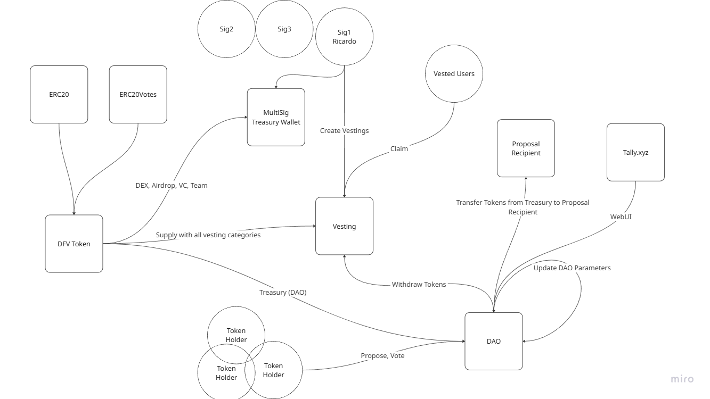

# 🚀 DFV Smart Contracts Core

A comprehensive suite of smart contracts for the DFV ecosystem, including governance token, vesting mechanisms, and DAO functionalities.

## 📋 Table of Contents

- [🔍 Overview](#overview)
- [🏗️ Architecture](#architecture)
- [⚙️ Setup](#setup)
- [🚀 Deployment](#deployment)
- [📍 Deployed Contracts](#deployed-contracts)
- [📄 Contract ABIs](#contract-abis)
- [🧪 Testing](#testing)
- [📊 Coverage](#coverage)
- [📋 Smart Contracts](#smart-contracts)
  - [DFVToken Contract](#dfvtoken-contract)
  - [DFVVesting Contract](#dfvvesting-contract)
  - [DFVDAO Contract](#dfvdao-contract)
  - [TimeLock Contract](#timelock-contract)
- [🔒 Security Features](#security-features)
- [🤝 Contributing](#contributing)
- [📄 License](#license)
- [📞 Support](#support)

---

<a id="overview"></a>

## 🔍 Overview

This repository contains the core smart contracts for the DFV ecosystem, built on Solidity 0.8.28. The contracts enable organizations to manage a governance token with comprehensive vesting mechanisms and implement DAO governance functionalities. All contracts are designed with security best practices, implementing OpenZeppelin's proven patterns and security features.

### Key Features

- **DFVToken Contract**: ERC20 governance token with voting capabilities and permit functionality
- **DFVVesting Contract**: Comprehensive vesting system with multiple categories and flexible scheduling
- **DFVDAO Contract**: Full governance framework with proposal creation, voting, and execution
- **TimeLock Contract**: Secure delayed execution mechanism for governance proposals
- **Security features**: Role-based access control, safe token transfers, comprehensive validation
- **Gas optimized** with efficient storage patterns and batch operations
- **Governance integration** with OpenZeppelin's Governor framework

### Token Distribution

The DFVToken has a total supply of **138,840,000,000 DFV tokens** distributed as follows:
- Blind Believers: approx. 15% (20,828,377,491.30 tokens)
- UNI V3 DFV/USDT: approx. 84.51% (117,334,651,306.91 tokens)
- DAO Treasury: approx. 0.35% (491,353,345.96	tokens)
- Community purchases: approx. 0.13% (185,617,855.83 tokens)
---

<a id="architecture"></a>

## 🏗️ Architecture

```
DFV Smart Contracts Architecture
├── DFVToken.sol
│   ├── Inherits from:
│   │   ├── ERC20 (Standard token functionality)
│   │   ├── ERC20Permit (Gasless approvals via signatures)
│   │   └── ERC20Votes (Governance voting power)
│   │
│   └── Core Features:
│       ├── Governance Token with Voting Power
│       ├── Permit Functionality (EIP-2612)
│       ├── Delegation and Vote Tracking
│       └── Initial Distribution to Key Addresses
│
├── DFVVesting.sol
│   ├── Inherits from:
│   │   ├── AccessControl (Role-based permissions)
│   │   └── IDFVVesting (Interface compliance)
│   │
│   └── Core Features:
│       ├── Multiple Vesting Categories Management
│       ├── Flexible Vesting Schedules
│       ├── Batch Operations for Efficiency
│       ├── Cliff and Linear Vesting Support
│       ├── Emergency Controls and Validation
│       └── Comprehensive Pool Management
│
├── DFVDAO.sol
│   ├── Inherits from:
│   │   ├── Governor (Core governance functionality)
│   │   ├── GovernorSettings (Configurable parameters)
│   │   ├── GovernorCountingSimple (Voting mechanism)
│   │   ├── GovernorVotes (Token-based voting power)
│   │   ├── GovernorVotesQuorumFraction (Quorum requirements)
│   │   └── GovernorTimelockControl (Delayed execution)
│   │
│   └── Core Features:
│       ├── Proposal Creation and Management
│       ├── Token-weighted Voting System
│       ├── Quorum and Threshold Requirements
│       ├── Timelock Integration for Security
│       └── Configurable Governance Parameters
│
├── TimeLock.sol
│   ├── Inherits from:
│   │   └── TimelockController (OpenZeppelin timelock)
│   │
│   └── Core Features:
│       ├── Delayed Execution of Proposals
│       ├── Multi-role Access Control
│       ├── Proposer and Executor Management
│       └── Minimum Delay Configuration
│
├── interfaces/
│   └── IDFVVesting.sol
│
└── dao/
    ├── DFVDAO.sol
    └── TimeLock.sol
```

### System Flow Diagram

The following diagram illustrates the complete ecosystem flow, showing how different components interact:



**Key Interactions:**

- **Token Distribution**: DFV Token is distributed to Vesting, Treasury, and other stakeholders
- **Vesting Management**: Multi-sig treasury wallet manages vesting pools for different user categories
- **Governance Flow**: Token holders can propose and vote on DAO proposals
- **Treasury Operations**: DAO can manage treasury funds and update parameters
- **Web Interface**: Tally.xyz provides governance interface for proposal management

---

<a id="setup"></a>

## ⚙️ Setup

### Prerequisites

- Node.js (v18 or higher)
- npm or yarn
- Git

### Installation

1. **Clone the repository:**

```bash
git clone https://github.com/lumos-codes-dev/dfv-sc-core.git
cd dfv-sc-core
```

2. **Install dependencies:**

```bash
npm install
```

3. **Configure environment variables:**
   Create a `.env` file in the root directory:

```env
PRIVATE_KEY="your_private_key_here";

MAINNET_RPC_URL="https://ethereum-rpc.publicnode.com";
BASE_RPC_URL="https://mainnet.base.org";
SEPOLIA_RPC_URL="https://ethereum-sepolia-rpc.publicnode.com";

ETHERSCAN_API_KEY="";
COINMARKETCAP_API_KEY="";
```

4. **Compile contracts:**

```bash
npm run compile
```

---

<a id="deployment"></a>

## 🚀 Deployment

The contracts are deployed using Hardhat deployment scripts. Deploy to different networks:

### Local Development

```bash
npx hardhat run scripts/deploy/sepolia.ts --network hardhat
```

### Sepolia Testnet

```bash
npx hardhat run scripts/deploy/sepolia.ts --network sepolia
```

### Ethereum Mainnet

```bash
npx hardhat run scripts/deploy/mainnet.ts --network ethereum
```

### Base Mainnet

```bash
npx hardhat run scripts/deploy/base.ts --network base
```

### Supported Networks

- `hardhat` (local development)
- `sepolia` (Ethereum testnet)
- `ethereum` (Ethereum mainnet)

---

<a id="deployed-contracts"></a>

## 📍 Deployed Contracts

_Deployment addresses will be updated after mainnet deployment_

| Contract   | Network | Address | Explorer Link |
| ---------- | ------- | ------- | ------------- |
| DFVToken   | Sepolia | TBD     | TBD           |
| DFVVesting | Sepolia | TBD     | TBD           |
| DFVDAO     | Sepolia | TBD     | TBD           |
| TimeLock   | Sepolia | TBD     | TBD           |

---

<a id="contract-abis"></a>

## 📄 Contract ABIs

The compiled contract ABIs are available in the `artifacts/contracts/` directory after compilation:

- **DFVToken ABI:** `artifacts/contracts/DFVToken.sol/DFVToken.json`
- **DFVVesting ABI:** `artifacts/contracts/DFVVesting.sol/DFVVesting.json`
- **DFVDAO ABI:** `artifacts/contracts/dao/DFVDAO.sol/DFVDAO.json`
- **TimeLock ABI:** `artifacts/contracts/dao/TimeLock.sol/TimeLock.json`

### TypeChain Integration

TypeScript types are automatically generated and available in the `typechain-types/` directory for type-safe contract interactions.

---

<a id="testing"></a>

## 🧪 Testing

### Run All Tests

```bash
npm run test
```

### Run Specific Test Files

```bash
npx hardhat test test/DFVToken.test.ts
npx hardhat test test/DFVVesting.test.ts
npx hardhat test test/DFVDAO.test.ts
```

### Run Tests with Gas Reporting

Gas reporting is enabled by default and includes:

- USD currency reporting
- CoinMarketCap integration for real-time pricing

---

<a id="coverage"></a>

## 📊 Coverage

### Generate Coverage Report

```bash
npm run coverage
```

This will:

1. Execute all tests with coverage tracking
2. Generate coverage reports in multiple formats:
   - HTML report: `coverage/index.html`
   - LCOV report: `coverage/lcov-report/index.html`
   - JSON data: `coverage/coverage-final.json`

### View Coverage

Open `coverage/index.html` in your browser for detailed coverage analysis including line, branch, function, and statement coverage.

---

<a id="smart-contracts"></a>

## 📋 Smart Contracts

### DFVToken Contract

The DFVToken contract implements a governance token with voting capabilities, permit functionality, and initial distribution to key ecosystem participants.

#### Key Features

- **ERC20 Standard** with 18 decimals and total supply of 138,840,000,000 tokens
- **Governance Integration** with vote delegation and tracking capabilities
- **Permit Functionality** for gasless approvals using EIP-2612 signatures
- **Initial Distribution** to vesting, treasury, team, and VC addresses
- **Vote Power Tracking** for DAO governance participation

#### Constructor Parameters

| Parameter   | Type    | Description                                       |
| ----------- | ------- | ------------------------------------------------- |
| `vesting_`  | address | Vesting contract address (receives ~15% of tokens) |
| `uni_`      | address | Treasury address (receives ~84.51% of tokens)       |
| `dao_`      | address | DAO Treasury address (receives ~0.35% of tokens)            |

#### Key Functions

**Standard ERC20 Functions:**
| Function | Description |
| ------------------------------------------- | ------------------------------------------ |
| `transfer(address to, uint256 amount)` | Transfers tokens to specified address |
| `approve(address spender, uint256 amount)` | Approves spender to use tokens |
| `balanceOf(address account)` | Returns token balance of account |
| `totalSupply()` | Returns total token supply |

**Governance Functions (ERC20Votes):**
| Function | Description |
| ---------------------------------------------------- | ---------------------------------------------- |
| `delegate(address delegatee)` | Delegates voting power to specified address |
| `getVotes(address account)` | Gets current voting power of account |
| `getPastVotes(address account, uint256 timepoint)` | Gets voting power at specific timepoint |
| `getPastTotalSupply(uint256 timepoint)` | Gets total supply at specific timepoint |

**Permit Functions (ERC20Permit):**
| Function | Description |
| ---------------------------------------------------- | ---------------------------------------------- |
| `permit(...)` | Enables gasless token approvals via signatures |
| `nonces(address owner)` | Returns current nonce for permit functionality |
| `DOMAIN_SEPARATOR()` | Returns EIP-712 domain separator |

**Clock Functions:**
| Function | Description |
| --------------- | ------------------------------------- |
| `clock()` | Returns current timestamp |
| `CLOCK_MODE()` | Returns clock mode ("mode=timestamp") |

### DFVVesting Contract

The DFVVesting contract manages token vesting for different beneficiary categories with flexible scheduling and comprehensive controls.

#### Key Features

- **Multiple Vesting Categories** with distinct rules and allocations
- **Flexible Vesting Schedules** supporting cliff periods and linear vesting
- **Batch Operations** for efficient management of multiple beneficiaries
- **Role-based Access Control** with admin and manager roles
- **Emergency Controls** for pausing and emergency withdrawals
- **Comprehensive Validation** to prevent over-allocation and ensure fair distribution

#### Vesting Categories

| Category          | Allocation          | Tokens per User | Max Participants |
| ----------------- | ------------------- | --------------- | ---------------- |
| Blind Believers   | 15% (20.83B tokens) | 694.2M tokens   | 30               |
| Eternal HODLers   | 10% (13.88B tokens) | 69.42M tokens   | 200              |
| Diamond Hands     | 5% (6.94B tokens)   | 6.942M tokens   | 1,000            |
| Just HODLers      | 10% (13.88B tokens) | 694.2K tokens   | 20,000           |
| Community Airdrop | 10% (13.88B tokens) | Variable amount | 10,000           |

**Vesting Details:**

- **Linear Vesting**: Tokens are released gradually over the vesting period
- **Total Vesting Duration**: Approximately 1 year (31,104,000 seconds) for most categories

#### Administrative Functions

| Function                            | Access  | Description                                           |
| ----------------------------------- | ------- | ----------------------------------------------------- |
| `setVestingToken(address token_)`   | Manager | Sets the vesting token address                        |
| `createCategoryPool(...)`           | Manager | Creates new vesting pool for specific category        |
| `createCustomVestingPool(...)`      | Manager | Creates custom vesting pool for beneficiary           |
| `createCustomVestingPoolBatch(...)` | Manager | Creates multiple custom pools in single transaction   |
| `createCategoryPoolBatch(...)`      | Manager | Creates multiple category pools in single transaction |
| `withdrawUnusedTokens(...)`         | Admin   | Withdraws unused tokens from contract                 |

#### User Functions

| Function                                  | Description                                    |
| ----------------------------------------- | ---------------------------------------------- |
| `claim()`                                 | Claims available vested tokens for caller      |
| `claimFor(address beneficiary)`           | Claims available vested tokens for beneficiary |
| `getClaimableAmount(address beneficiary)` | Calculates currently claimable tokens          |

### DFVDAO Contract

The DFVDAO contract implements a comprehensive governance system using OpenZeppelin's Governor framework with timelock security.

#### Key Features

- **Proposal Management** with creation, voting, and execution phases
- **Token-weighted Voting** based on DFV token holdings and delegation
- **Quorum Requirements** ensuring sufficient participation for valid decisions
- **Timelock Integration** providing security delay for proposal execution
- **Configurable Parameters** for voting delays, periods, and thresholds

#### Key Functions

| Function                                      | Description                                 |
| --------------------------------------------- | ------------------------------------------- |
| `propose(...)`                                | Creates new governance proposal             |
| `castVote(uint256 proposalId, uint8 support)` | Casts vote on proposal                      |
| `execute(...)`                                | Executes approved proposal after timelock   |
| `proposalThreshold()`                         | Returns minimum tokens needed for proposals |
| `quorum(uint256 blockNumber)`                 | Calculates required quorum at block         |

### TimeLock Contract

The TimeLock contract provides secure delayed execution for governance proposals, ensuring community has time to react to approved changes.

#### Key Features

- **Delayed Execution** with configurable minimum delay
- **Role-based Access Control** with proposer and executor roles
- **Multi-signature Support** through role-based permissions
- **Cancellation Capability** for emergency situations

#### Configuration

| Parameter   | Description                                   |
| ----------- | --------------------------------------------- |
| `minDelay`  | Minimum time delay before execution (seconds) |
| `proposers` | Addresses allowed to schedule operations      |
| `executors` | Addresses allowed to execute operations       |
| `admin`     | Address with administrative privileges        |

---

<a id="security-features"></a>

## 🔒 Security Features

### Access Control

- Role-based permissions using OpenZeppelin's AccessControl
- Multi-signature support through timelock mechanism
- Emergency pause functionality for critical situations

### Input Validation

- Comprehensive parameter validation in all functions
- Zero address checks and boundary validations
- Overflow protection with Solidity 0.8+ built-in checks

### Reentrancy Protection

- SafeERC20 for all token transfers
- Proper state updates before external calls
- Validated interaction patterns

### Testing & Auditing

- Comprehensive test suite with >95% coverage
- Gas optimization and efficiency testing
- Integration tests for complex workflows

---

<a id="contributing"></a>

## 🤝 Contributing

1. Fork the repository
2. Create your feature branch (`git checkout -b feature/amazing-feature`)
3. Commit your changes (`git commit -m 'Add some amazing feature'`)
4. Push to the branch (`git push origin feature/amazing-feature`)
5. Open a Pull Request

---

<a id="license"></a>

## 📄 License

This project is licensed under the MIT License - see the [LICENSE](LICENSE) file for details.

---

<a id="support"></a>

## 📞 Support

For questions, issues, or support:

- GitHub Issues: [dfv-sc-core/issues](https://github.com/lumos-codes-dev/dfv-sc-core/issues)
- Repository: [dfv-sc-core](https://github.com/lumos-codes-dev/dfv-sc-core)

---

_Built with ❤️ by the DFV community_
